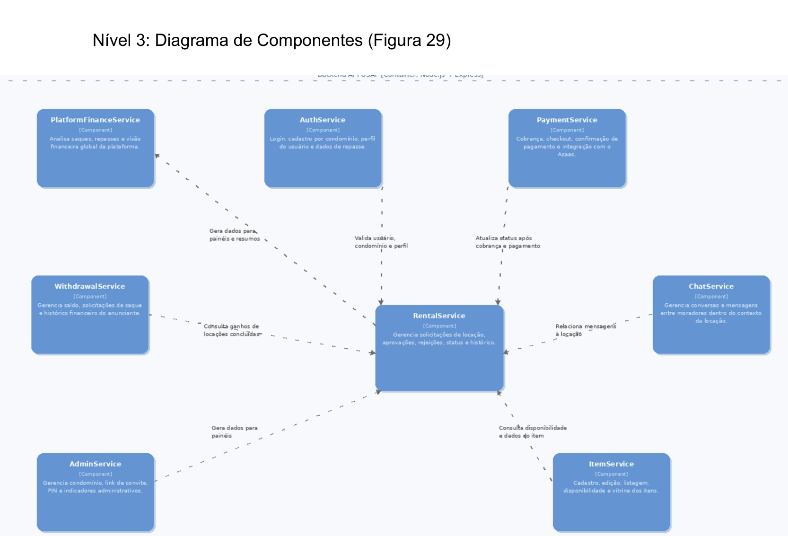

# C4 — Nível 3: Diagrama de Componentes

Diagrama tal como definido na RFC (Seção 5.1, Figura 29): os componentes internos do Backend API e
como se relacionam.

*Figura 29: Diagrama C4 — Nível 3: Diagrama de Componentes*

> **Nota:** este diagrama é o modelo original da RFC. O código atual organiza os mesmos
> responsabilidades em módulos por domínio (`auth`, `itens`, `locacoes`, `mensagens`, `saques`,
> `sindico`, `admin`) mais dois módulos adicionados depois da RFC — `mural` e `conversas` — sem
> correspondência direta nesta figura. Ver [Requisitos Funcionais](https://github.com/gustavovieiira/TCC-USAI2.0/wiki/Requisitos-Funcionais)
> na Wiki para o mapeamento módulo a módulo com o código.

Ver também [Nível 1 — Contexto](c4-contexto.md) e [Nível 2 — Containers](c4-containers.md).
