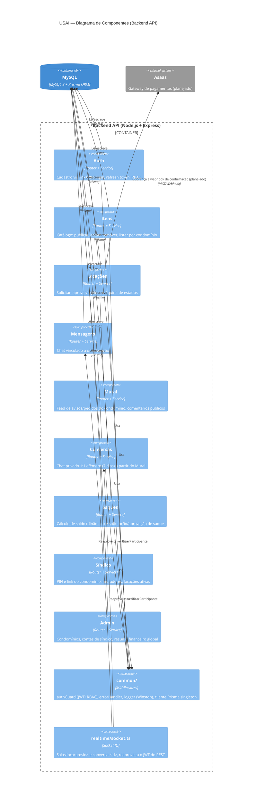

# C4 — Nível 3: Diagrama de Componentes

Dentro do container "Backend API": um módulo por domínio (`apps/backend/src/modules/<dominio>/`),
todos seguindo o mesmo padrão de camadas (`routes → controller → service → schemas/types`), mais a
camada `common/` (transversal) e o servidor de WebSocket.

Ver [Nível 1 — Contexto](c4-contexto.md) e [Nível 2 — Containers](c4-containers.md).
