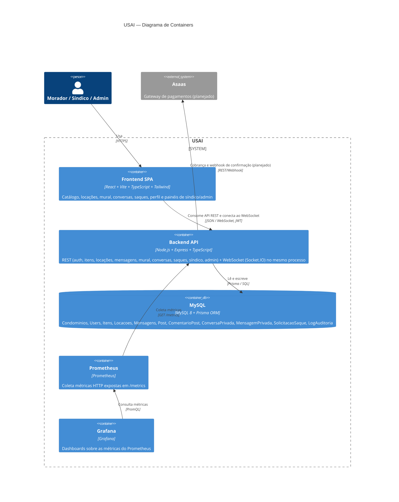

# C4 — Nível 2: Diagrama de Containers

Como a USAI é dividida por dentro: uma SPA, uma API que também fala WebSocket, um banco relacional e
a stack de observabilidade — tudo orquestrado via Docker Compose.

Ver [Nível 1 — Contexto](c4-contexto.md) e [Nível 3 — Componentes](c4-componentes.md).
