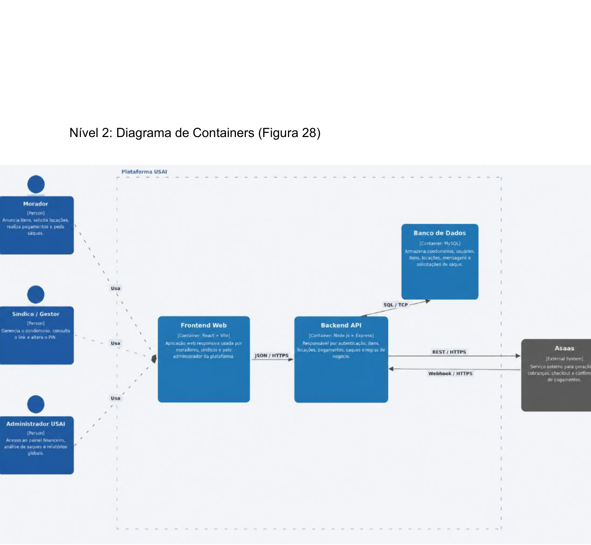

# C4 — Nível 2: Diagrama de Containers

Diagrama tal como definido na RFC (Seção 5.1, Figura 28): como a USAI é dividida por dentro —
frontend, backend, banco de dados e a integração externa com o Asaas.

*Figura 28: Diagrama C4 — Nível 2: Diagrama de Containers*

Ver também [Nível 1 — Contexto](c4-contexto.md) e [Nível 3 — Componentes](c4-componentes.md).
