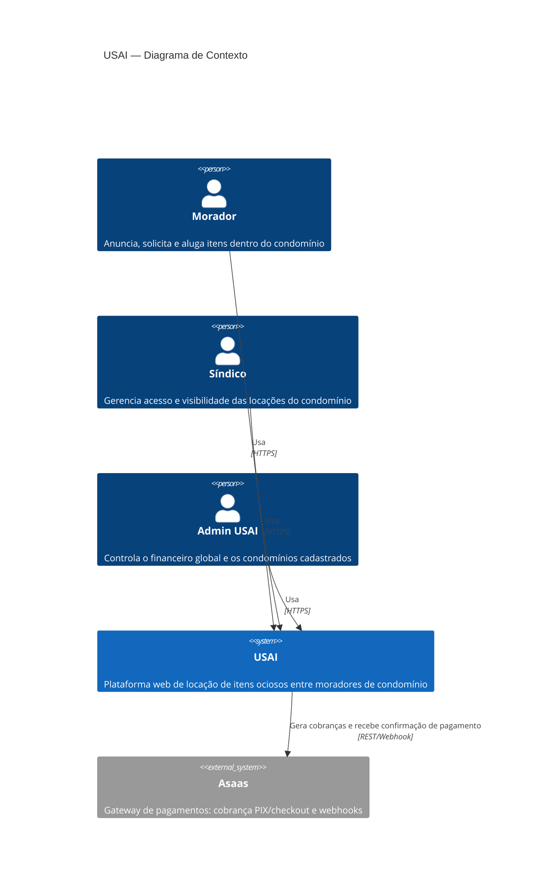

# C4 — Nível 1: Diagrama de Contexto

Visão de alto nível: quem usa a USAI e com quais sistemas externos ela conversa.

Ver também [Nível 2 — Containers](c4-containers.md) e [Nível 3 — Componentes](c4-componentes.md).
