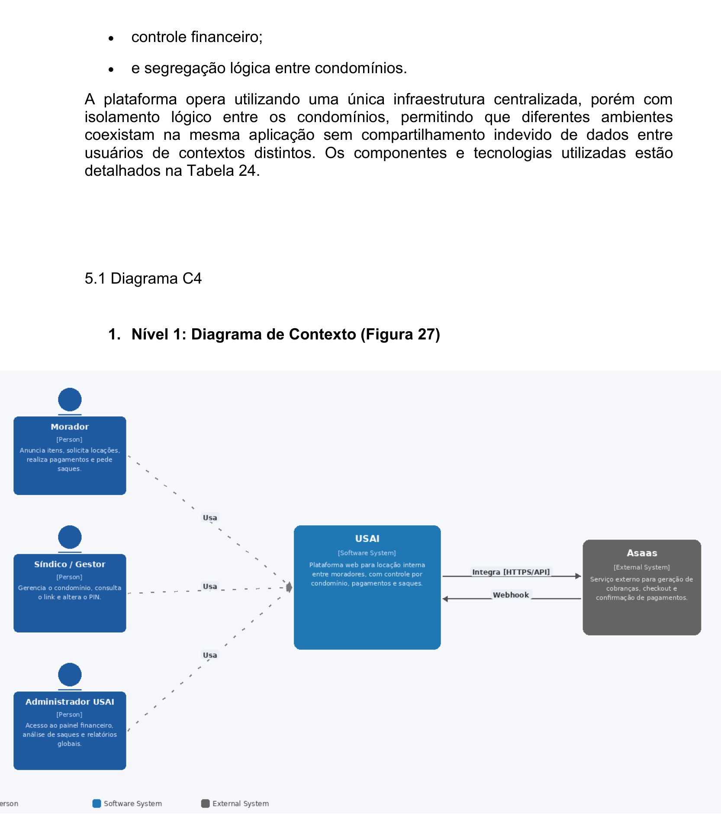

# C4 — Nível 1: Diagrama de Contexto

Diagrama tal como definido na RFC (Seção 5.1, Figura 27): quem usa a USAI e com quais sistemas
externos ela conversa.

*Figura 27: Diagrama C4 — Nível 1: Diagrama de Contexto*

Ver também [Nível 2 — Containers](c4-containers.md) e [Nível 3 — Componentes](c4-componentes.md).
