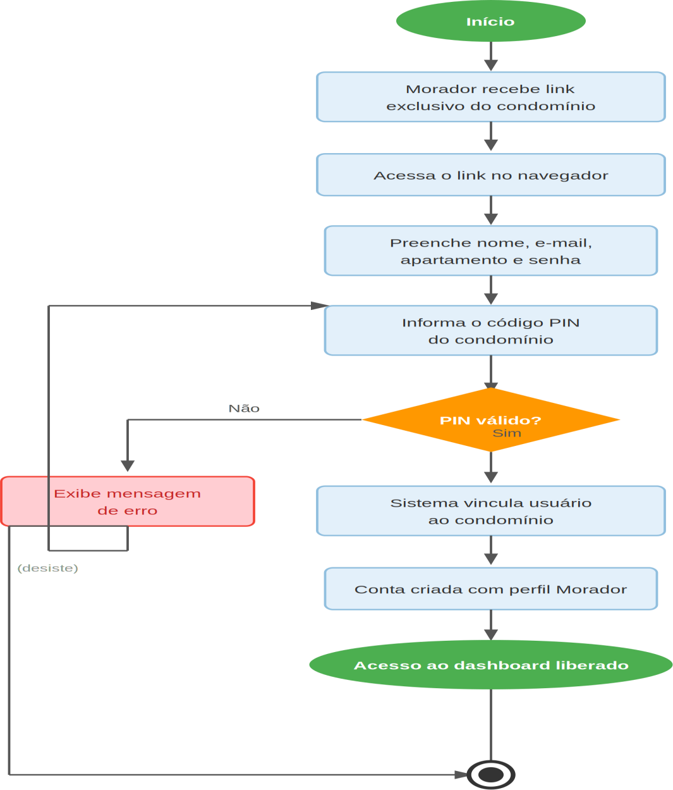

# Figura 1 — Fluxo 1 — Primeiro Acesso ao Condomínio

RFC — USAI, Seção 3.1 Fluxos Principais.

Morador acessa o link exclusivo do condomínio, informa o PIN, cria a conta e é vinculado ao condomínio automaticamente.

Ver também o [índice de figuras](README.md).
