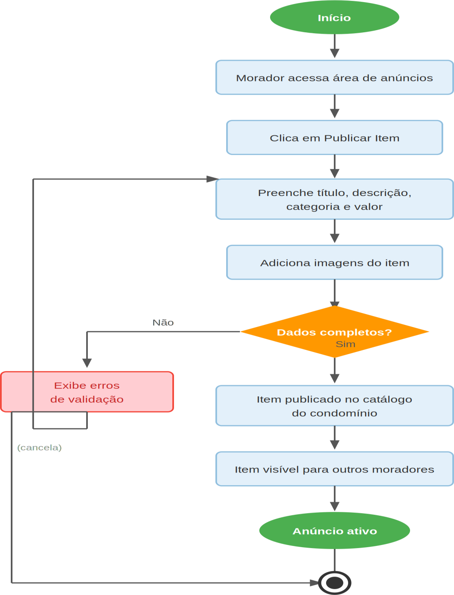

# Figura 2 — Fluxo 2 — Publicação de Item

RFC — USAI, Seção 3.1 Fluxos Principais.

Morador preenche título, descrição, categoria, valor e imagens; o item é publicado no catálogo do condomínio.

Ver também o [índice de figuras](README.md).
