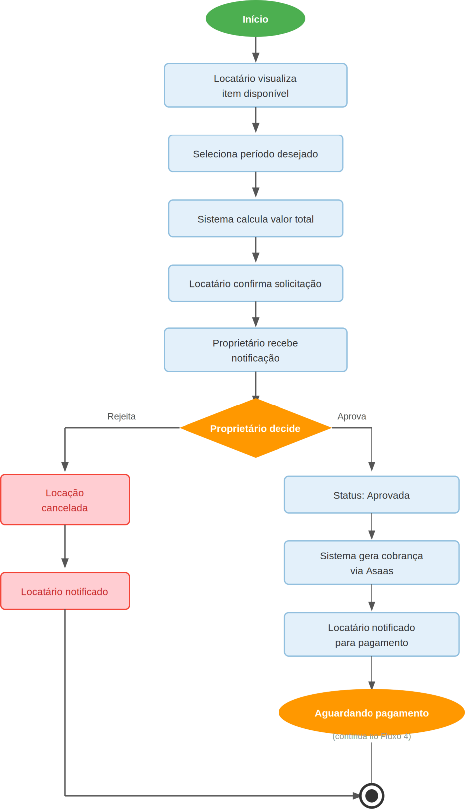

# Figura 3 — Fluxo 3 — Solicitação e Aprovação da Locação

RFC — USAI, Seção 3.1 Fluxos Principais.

Locatário seleciona o item e o período e envia a solicitação; o proprietário aprova ou rejeita.

Ver também o [índice de figuras](README.md).
