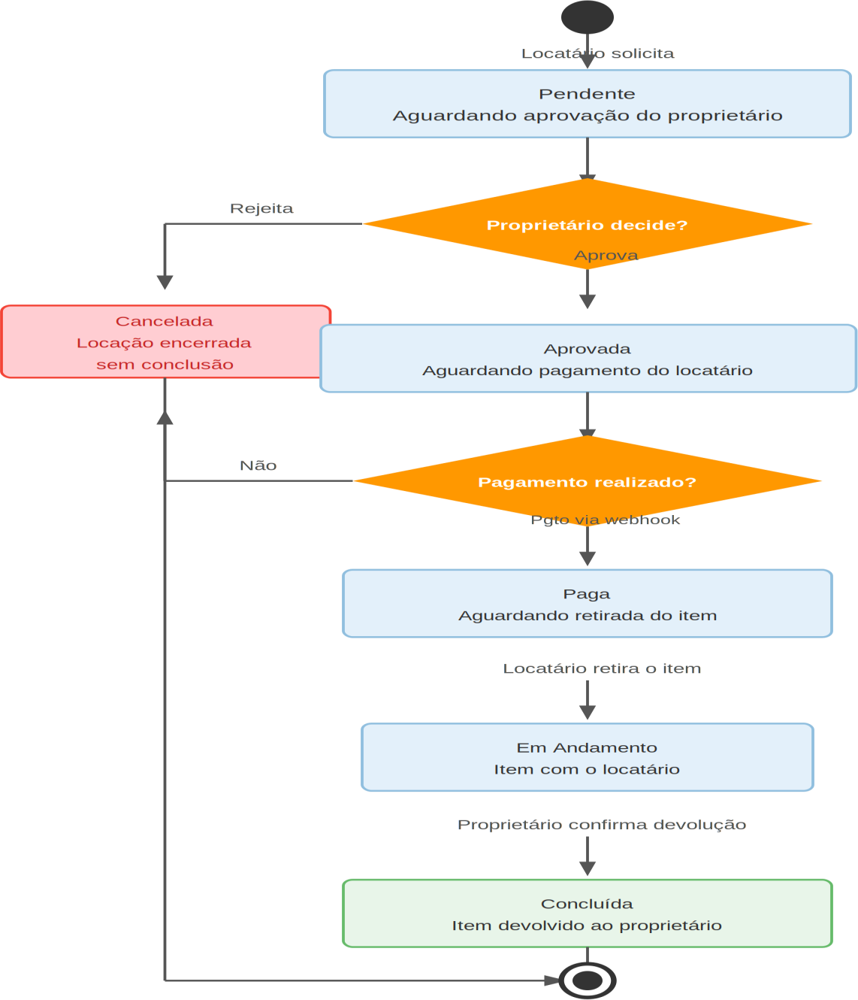

# Figura 4 — Fluxo 4 — Máquina de Estados da Locação

RFC — USAI, Seção 3.1 Fluxos Principais.

Estados possíveis da locação: Pendente → Aprovada → Paga → Em Andamento → Concluída, com cancelamento possível a partir de Pendente ou Aprovada.

Ver também o [índice de figuras](README.md).
