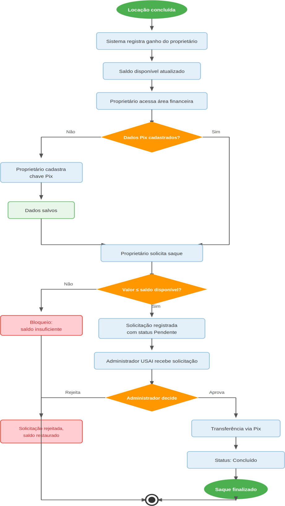

# Figura 5 — Fluxo 5 — Fluxo Financeiro e Saque

RFC — USAI, Seção 3.1 Fluxos Principais.

Locação paga gera ganho no saldo do proprietário; o proprietário cadastra a chave Pix e solicita o saque, que o Admin USAI analisa e aprova ou rejeita.

Ver também o [índice de figuras](README.md).
