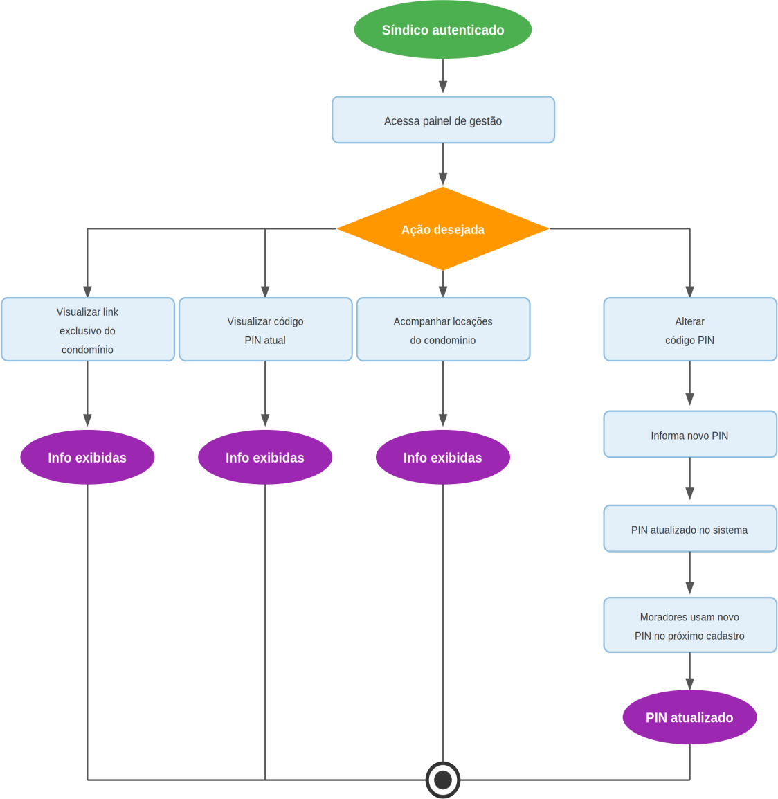

# Figura 6 — Fluxo 6 — Gestão do Condomínio

RFC — USAI, Seção 3.1 Fluxos Principais.

Síndico visualiza o link e o PIN do condomínio, altera o PIN quando necessário e acompanha as locações ativas.

Ver também o [índice de figuras](README.md).
