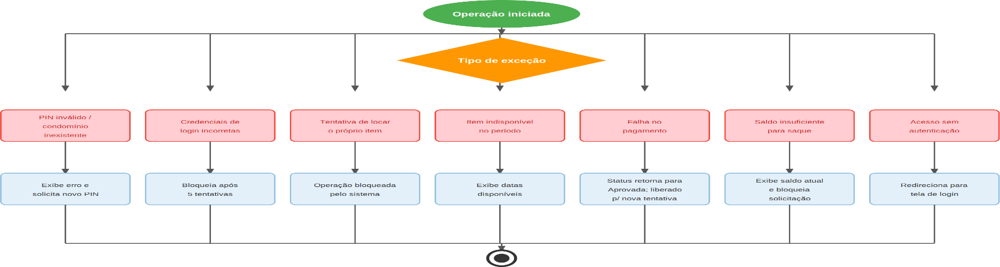

# Figura 7 — Fluxo 7 — Fluxos de Exceção

RFC — USAI, Seção 3.1 Fluxos Principais.

Tratamento dos principais cenários de erro: PIN inválido, credenciais incorretas, item indisponível, tentativa de locar o próprio item, falha no pagamento, saldo insuficiente e acesso sem autenticação.

Ver também o [índice de figuras](README.md).
