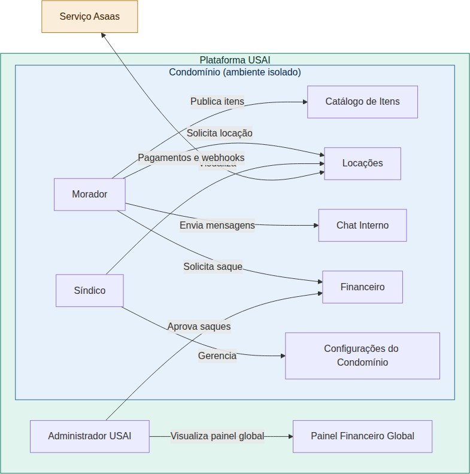

# Figura 8 — Fluxo 8 — Arquitetura Conceitual dos Perfis

RFC — USAI, Seção 3.1 Fluxos Principais.

Visão geral da plataforma com os perfis de usuário, os módulos do sistema e a integração externa com o Asaas.

Ver também o [índice de figuras](README.md).
