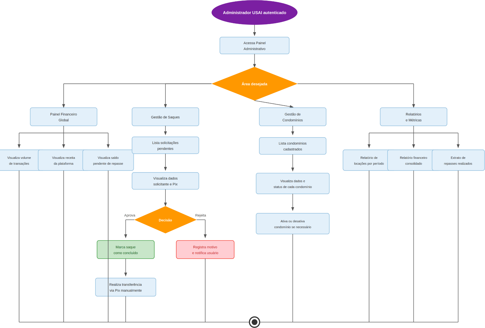

# Figura 9 — Fluxo 9 — Painel Administrativo USAI

RFC — USAI, Seção 3.1 Fluxos Principais.

O administrador acessa quatro áreas: Painel Financeiro Global, Gestão de Saques, Controle de Condomínios e Relatórios.

Ver também o [índice de figuras](README.md).
