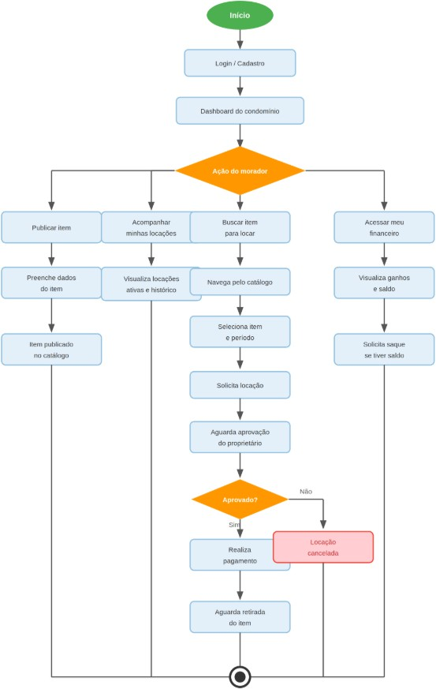

# Figura 10 — Diagrama de Atividade — Morador

RFC — USAI, Seção 3.2 Diagramas de Atividade.

Fluxo principal de ações disponíveis para o morador na plataforma.

Ver também o [índice de figuras](README.md).
