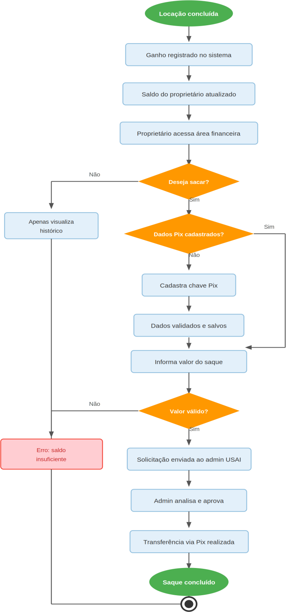

# Figura 12 — Diagrama de Atividade — Financeiro e Saque

RFC — USAI, Seção 3.2 Diagramas de Atividade.

Processo de ganho, cadastro de chave Pix e solicitação de repasse.

Ver também o [índice de figuras](README.md).
