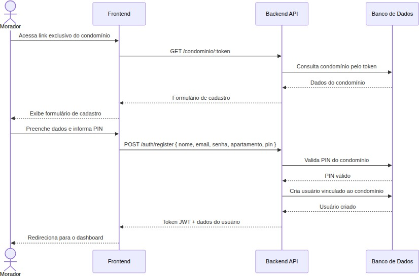

# Figura 13 — Diagrama de Sequência — Primeiro Acesso

RFC — USAI, Seção 3.3 Diagramas de Sequência.

Interações entre os componentes do sistema durante o primeiro acesso do morador.

Ver também o [índice de figuras](README.md).
