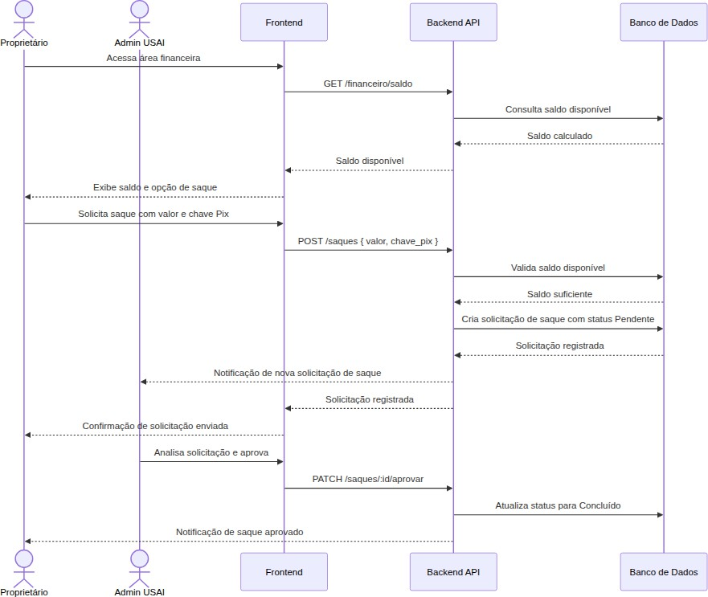

# Figura 15 — Diagrama de Sequência — Saque do Proprietário

RFC — USAI, Seção 3.3 Diagramas de Sequência.

Processo de solicitação e processamento de saque pelo proprietário.

Ver também o [índice de figuras](README.md).
