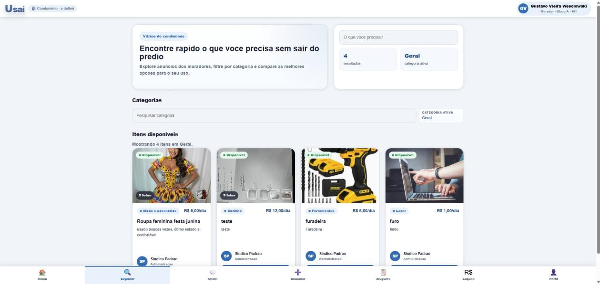

# Figura 18 — Tela — Catálogo de itens (Vitrine do condomínio)

RFC — USAI, Seção 4.1 Mockups (UX) — mockup original da v1.1.

> O visual efetivamente implementado é diferente deste mockup — ver a [identidade visual v2.0](https://github.com/gustavovieiira/TCC-USAI2.0/wiki/Decisoes-Tecnicas) e capturas de tela reais na Wiki.

Explora todos os itens disponíveis para locação dentro do condomínio, com busca e total de resultados por categoria.

Ver também o [índice de figuras](README.md).
