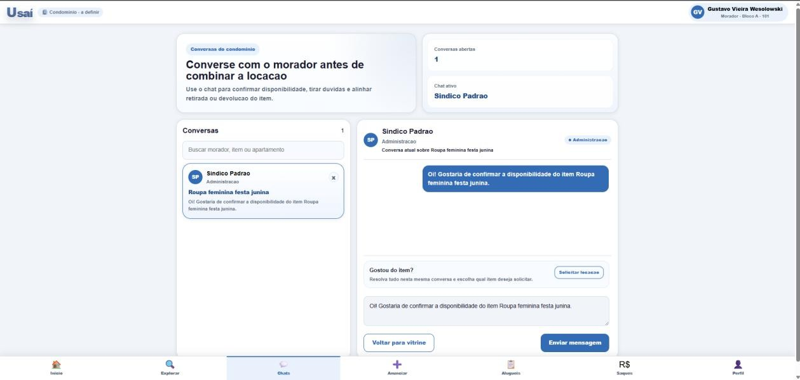

# Figura 19 — Tela — Chats

RFC — USAI, Seção 4.1 Mockups (UX) — mockup original da v1.1.

> O visual efetivamente implementado é diferente deste mockup — ver a [identidade visual v2.0](https://github.com/gustavovieiira/TCC-USAI2.0/wiki/Decisoes-Tecnicas) e capturas de tela reais na Wiki.

Lista de conversas abertas com nome do morador, item relacionado e prévia da última mensagem, com busca por morador, item ou apartamento.

Ver também o [índice de figuras](README.md).
