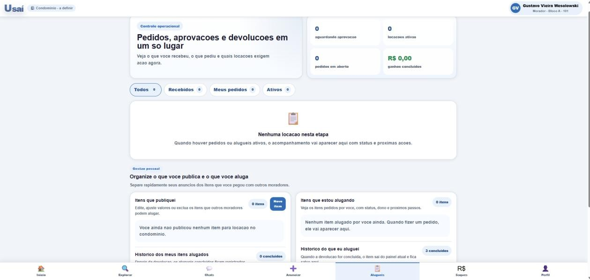

# Figura 21 — Tela — Acompanhamento de locações

RFC — USAI, Seção 4.1 Mockups (UX) — mockup original da v1.1.

> O visual efetivamente implementado é diferente deste mockup — ver a [identidade visual v2.0](https://github.com/gustavovieiira/TCC-USAI2.0/wiki/Decisoes-Tecnicas) e capturas de tela reais na Wiki.

Controle operacional de todas as locações do morador, com contadores de locações aguardando aprovação, ativas, pedidos em aberto e ganhos concluídos.

Ver também o [índice de figuras](README.md).
