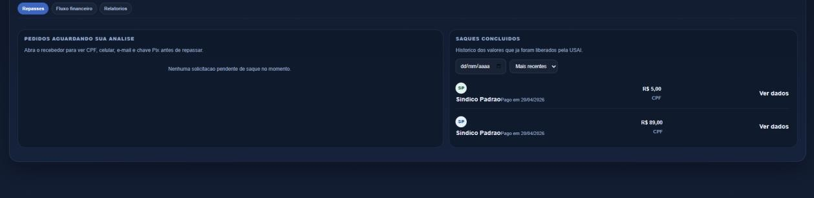

# Figura 26 — Tela — Painel de saques pendentes

RFC — USAI, Seção 4.1 Mockups (UX) — mockup original da v1.1.

> O visual efetivamente implementado é diferente deste mockup — ver a [identidade visual v2.0](https://github.com/gustavovieiira/TCC-USAI2.0/wiki/Decisoes-Tecnicas) e capturas de tela reais na Wiki.

Lista de solicitações de saque com dados do recebedor, valor, chave Pix e status, para o administrador analisar e processar cada pedido.

Ver também o [índice de figuras](README.md).
