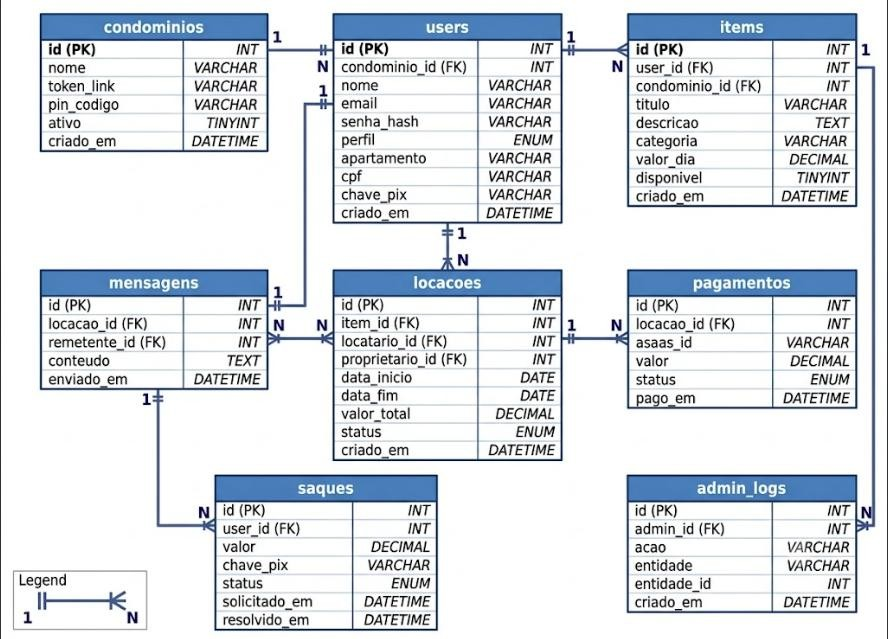

# Figura 30 — Modelo de Dados da plataforma USAI

RFC — USAI, Seção 5.2 Modelo de Dados.

Entidades e relacionamentos do banco de dados da USAI (modelo da v1.1 — desde então foram adicionados Post, ComentarioPost, ConversaPrivada e MensagemPrivada, que dão suporte ao Mural e às Conversas privadas).

Ver também o [índice de figuras](README.md).
